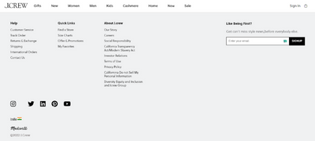

# TEAM ACRAS

### About
 

This repository containes the complete files of a simple working of an E-Commerce website. This is our Construct Week Project and the assigned website for our group was JCREW - an international clothing brand. This project uses HTML, CSS, Javascript to shocase the functioning of an E-Commerce website. The maain objective of the project was to make the user have an easier experience shopping and maintain the claen design.

This features of this project are : 
    <ul>
        <li>Fully functional Mega-menu from the Navbar</li>
        <li>Signup & Login Functionality which stores your data</li>
        <li>Admin Login and Admin Dashboard that adds products to the main website</li>
        <li>Complete Navbar & Footer implemented using Import/Export functionality</li>
        <li>Different pages for both Men and Womens section of the shop</li>
        <li>All shop pages includes Choice of size, Filtering and Sorting techniques</li>
        <li>Add to cart functionality</li>
        <li>Cart to Checkout imitating the original webiste</li>
        <li>On payment the cart value and the cart items are removed from DOM and user is redirected to Home Page</li>
    </ul>

 

### Site Assigned to us was <a href="https://www.jcrew.com/in/"> J.CREW </a>
 
 

# Team ACRAS:
<ul>
    <li>Akshay Verma</li>
    <li>Rakesh Pasupathy</li>
    <li>Akash Singha</li>
    <li>Swarup Kadoli</li>
    <li>Chukka Praveen Kumar</li>
</ul>
 

## A Glimpse of what we have built
 

 
 

### Site we have made - <a href="https://acras.netlify.app/" target="black">Take me there 👉🏼</a>

 

### Use this link to clone our Repository - <a href="https://github.com/Dante2109/enormous-step-3337.git">Click Here</a>

 

### Video Presentation Link - <a href="https://drive.google.com/file/d/1OnSolA1DKzKf1ZxkRejfw4nF8g7qjT-L/view?usp=sharing">Watch the presentation</a>

 

<i>Any further updates will be notified with both the new feaatures added along with the version of most recent update</i>

 

### Regards Team ACRAS
